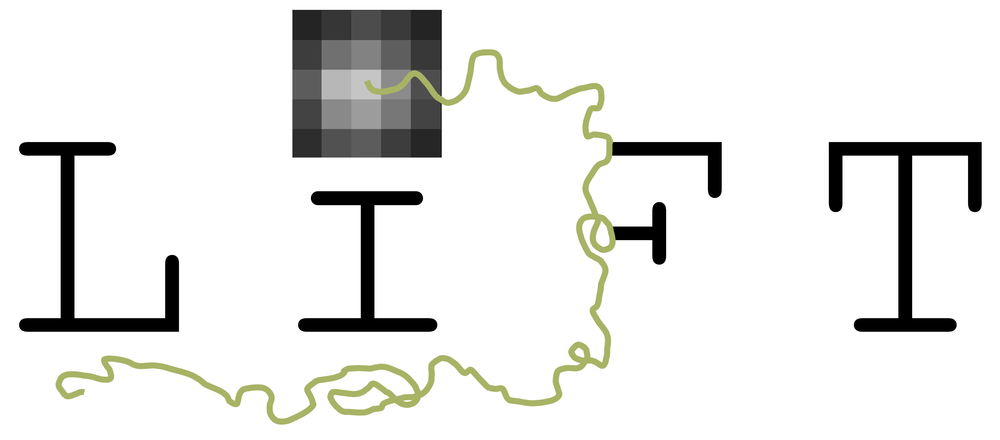

<p align="center">
  
</p>

# LiFT – Live Foci Tracking

LiFT is an end-to-end pipeline for detecting and tracking DNA-damage foci (e.g. γH2AX, 53BP1) in live-cell fluorescence microscopy timelapse data. Starting from raw multi-frame TIFF stacks, it segments and tracks nuclei, crops each cell into its own image stack, corrects for motion, detects foci frame-by-frame, and tracks individual foci over time to quantify repair kinetics.

---

## Pipeline overview

<p align="center">
  
</p>

The pipeline runs in seven sequential steps:

| Step | Name | Description |
|------|------|-------------|
| 1 | **Nuclei segmentation** | Detect and segment nuclei in every frame using Cellpose-SAM or Cellpose-V3 |
| 2 | **Nuclei tracking** | Link segmented nuclei across frames to build single-cell trajectories |
| 3 | **Cell cropping** | Crop each tracked nucleus into a separate image stack |
| 4 | **Registration** | Correct for translational and rotation within each cropped cell stack |
| 5 | **Foci detection** | Detect DNA-damage foci in the registered stacks |
| 6 | **Foci tracking** | Track individual foci over time to quantify repair kinetics |

---

## Four ways to run LiFT

### 1. Interactive GUI — `LiFT_app.py`

A browser-based interface. Each step has a dedicated page where you can tune parameters, run a preview on a randomly selected cell, and then launch the full run on all data with a progress bar.

```bash
python LiFT_app.py
```

Then open [http://localhost:5000](http://localhost:5000) in your browser. Work through steps 1–6 in order. When you click **Run all** for any step, the current parameters are automatically saved to `parameters.yml` inside your data folder.

---

### 2. Jupyter notebook — `LiFT_notebook.ipynb`

The same pipeline exposed as a step-by-step notebook. Useful for exploratory analysis, custom preprocessing, or integrating the pipeline into a broader workflow. Each section contains a user-options cell where you set parameters, a preview cell to visualise results on a subset, and a run-all cell that saves parameters to `parameters.yml` and processes the full dataset.

```bash
jupyter notebook LiFT_notebook.ipynb
```

---

### 3. Command-line runner — `LiFT.py`

Reads the `parameters.yml` written by the GUI or notebook and re-runs the full pipeline on a new data folder with identical settings. More experienced users can also write a custom `parameters.yml` with their desired settings. Intended for batch reproduction and HPC submission.

```bash
# Run all steps
python LiFT.py data/

# Run specific steps only
python LiFT.py data/ --steps 1 2 5 6
```

Programmatic use:

```python
import LiFT

LiFT.run("data/")
# or specific steps only by adding: steps=[1, 2, 5, 6]
```

---
 
### 4. Python API
 
Every pipeline step is available as a Python function. Parameters can come from `parameters.yml` or be passed explicitly — explicit arguments always win over config.
 
```python
import lift
 
# run the full pipeline from config
lift.run("data/experiment_name")
lift.run("data/experiment_name", steps=[1, 2, 5, 6])
 
# or call individual steps
lift.segment("data/experiment_name")
lift.segment("data/experiment_name", method="cellpose_v3", diameter=120, min_area=500)
 
lift.track_nuclei("data/experiment_name")
lift.track_nuclei("data/experiment_name", method="IOU", min_length=15)
 
lift.crop("data/experiment_name", margin=50)
 
lift.register("data/experiment_name")
lift.register("data/experiment_name", method="stackreg")
 
lift.detect("data/experiment_name")
lift.detect("data/experiment_name", method="TopHat", threshold=36, sigma=0.6, radius=3.0)
 
lift.track_foci("data/experiment_name")
lift.track_foci("data/experiment_name", method="GNN", max_distance=8.0, gap_closing=3)
```
 
---

## CLI reference
 
```
lift info                                         # show installed optional packages
lift init [data_path]                             # generate parameters.yml (default: cwd)
lift config [data_path] [key.path=value ...]      # interactive editor or set values directly
lift run <data_path> [--steps N ...]              # run pipeline
lift <data_path> [--steps N ...]                  # shorthand for lift run
```
 
### `lift init`
 
Probes your environment for installed optional packages and writes a `parameters.yml` with the best available defaults, also checks currently installed packages and inserts these as options:
 
```bash
lift init                          # writes to current directory
lift init data/experiment_name     # writes to specified path
```
 
### `lift config`
 
With no arguments, opens an interactive editor that walks through every parameter step by step, showing the current value and available options. Press Enter to keep a value unchanged, or type a new one. Ctrl+C saves what has been changed so far and exits.
 
```bash
lift config                        # interactive editor in current directory
lift config data/experiment_name   # interactive editor at path
```
 
To set values directly without the interactive editor:
 
```bash
lift config step5_detection.threshold=40
lift config step5_detection.method=TopHat step5_detection.params.radius=3.0
lift config step1_segmentation.segmentation.min_area=500
lift config step4_registration.preprocessing=null
lift config data/experiment_name step5_detection.threshold=40
```
 
With no `key=value` arguments, prints the current config.
 
---

## Parameter reproducibility

Every time you click **Run all** in the GUI or execute the run-all cell in the notebook, the full parameter set is written to `<data_folder>/parameters.yml`. This file records all settings for every step that has been run, grouped by step:

```yaml
step1_segmentation:
  segmentation:
    method: cellpose_sam
    flow_threshold: 0.0
    cellprob_threshold: -0.5
    min_area: 1000
    cellpose_sam:
      scale_factor: 0.5
    cellpose_v3:
      diameter: 140.0
  preprocessing:
    method: None
    wavelet_filtering:
      scales: 5
      w_factor: 1.5
      start_scale: 2
    contrast_adjuster:
      sigma: 3.0
      c_factor: 6.0

:
:
:

step5_detection:
  method: TopHat
  threshold: 36.0
  return_segmentation: false
  params:
    sigma: 0.6
    radius: 6.0
# ... steps 2–4 and 6 follow the same pattern
```

Experienced users can also write a minimal `parameters.yml` by hand — any sub-keys that are absent fall back to function defaults, so only the settings that differ from defaults need to be specified.

---

## Supported algorithms

### Nuclei segmentation (Step 1)
| Method | Notes |
|--------|-------|
| `cellpose_sam` | Cellpose with SAM backbone; scale-factor controls effective nucleus size |
| `cellpose_v3` | Cellpose V3 with diameter parameter |

Optional preprocessing before segmentation to transform the foci signal into a signal resembling a nuclear (DAPI like) staining:
- `wavelet_filtering` — multi-scale wavelet coefficient thresholding
- `contrast_adjuster` — Gaussian-based contrast adjustment

### Nuclei tracking (Step 2)
| Method | Notes |
|--------|-------|
| `IOU` | Intersection-over-union based linking |
| `NND` | Greedy Nearest Neighbour Diffusion |
| `trackastra` | deep-learning tracker (Trackastra) |

### Registration (Step 4)
| Method | Notes |
|--------|-------|
| `stackreg` | StackReg rigid translation (PyStackReg) |
| `elastix` | Elastix; supports MSE, MI, and NCC loss functions |

Optional preprocessing for registration: `wavelet_denoise`, `threshold`, `DOG_filter`.

### Foci detection (Step 5)
| Method | Notes |
|--------|-------|
| `TopHat` | top-hat morphological filter |
| `LOG` | Laplacian of Gaussian |
| `Hessian` | Hessian-based blob detector |
| `Wavelets` | Isotropic undecimated wavelet transform with thresholding of the coefficients |
| `HDome` | H-dome transform |
| `HDome-smal` | H-dome with LOG pre-filter |
| `MPHD` | Maximum Possible Height Dome |
| `Spotiflow` | deep-learning spot detector (Spotiflow) |

### Foci tracking (Step 6)
| Method | Notes |
|--------|-------|
| `GNN` | Global Nearest Neighbour |
| `NGMA` | Non-iterative Greedy Multi-frame Assignment |
| `trackastra` | deep-learning tracker |

---

## Expected data structure

LiFT expects input data organised as:

```
data_folder/
  condition/
    experiment_date/
      Pos001/
        raw/ 
          0000.tif
          0001.tif   
          0002.tif  
          :       
      Pos002/
        raw/
      ...
  parameters.yml          ← written automatically; can be pre-populated
```

Intermediate and final outputs are written alongside the input inside each `Pos*/results/` folder.

---

## Installation

> **Note:** Detailed installation instructions will be added here.

---

## Citation

If you use LiFT in your research, please cite:

> *Citation will be added here upon publication.*
